# Le cycle de vie d'un incident

> Document de conception — aucune table ni ligne de code modifiée. Sert de
> base de discussion avant traduction en schéma et en code.

Du signalement par l'occupant à la clôture du ticket : chaque étape du
traitement d'un incident technique en copropriété, avec ce qui relève de la
seule logique du programme, ce qui nécessite un appel à Claude, et ce qui
exige impérativement une intervention humaine.

Version HTML illustrée (mise en forme, légende colorée) : voir l'artifact
publié — lien à conserver séparément, ce fichier est la version texte de
référence versionnée avec le code.

## Légende

**Classification de l'étape**
- 🟩 Logique programme + base de données seule
- 🟦 Appel à l'API Claude
- 🟧 Intervention humaine obligatoire
- 🟪 Acte d'un tiers externe (occupant, prestataire)

**Acteurs**
- `OCC` Occupant déclarant
- `IA` Gestionnaire IA
- `GH` Gestionnaire humain
- `CS` Conseil syndical
- `AG` Assemblée générale
- `PR` Prestataire

## Vue d'ensemble

La décision de traitement n'est plus une seule bifurcation à quatre
branches : c'est une chaîne de vérifications indépendantes (périmètre,
urgence, puis les quatre seuils légaux de la loi du 10 juillet 1965), qui se
combinent plutôt que de s'exclure.

```mermaid
flowchart TD
    A["Signalement (OCC)"]:::external --> B["Réception + dédoublonnage"]:::logic
    B --> C["Identification expéditeur"]:::logic
    C --> D{"Copropriété / rôle déterminés ?"}
    D -- "ambigu" --> D1["Arbitrage Claude"]:::claude
    D -- "introuvable" --> D2["Identification manuelle"]:::human
    D -- "univoque" --> E
    D1 --> E["Classification de la ou des actions"]:::claude
    D2 --> E
    E --> F{"Confiance suffisante ?"}
    F -- "non" --> F1["Classification manuelle"]:::human
    F -- "oui" --> G["Qualification : catégorie, urgence, coût indicatif"]:::claude
    F1 --> G

    G --> Q0{"Hors périmètre du syndic ?"}
    Q0 -- "oui" --> QD["Réorientation propriétaire / assurance"]:::human
    QD --> Z(["Fin — hors syndic"])
    Q0 -- "ambigu (limite privatif/commun)" --> Q0H{"Arbitrage humain : dans le périmètre ?"}
    Q0H -- "non" --> QD
    Q0H -- "oui" --> Q1
    Q0 -- "non" --> Q1{"Urgence sécuritaire ?"}
    Q1 -- "oui" --> QU["Intervention immédiate + info GH + CR a posteriori CS"]:::claude
    QU --> J

    Q1 -- "non" --> P{"Prestataire sous contrat pour cette copropriété + cette catégorie ?"}
    P -- "oui" --> P1["Prestataire retenu = celui sous contrat"]:::logic
    P -- "non" --> P2["Recherche dans le répertoire (compétence + zone d'intervention)"]:::logic
    P2 --> P3{"Un prestataire du répertoire correspond ?"}
    P3 -- "oui" --> P1
    P3 -- "aucun" --> P4["Recherche humaine d'un nouveau prestataire"]:::human
    P4 --> P1

    P1 --> Q2{"Montant ≤ plafond D (ordre de service) ?"}
    Q2 -- "oui" --> QA["Intervention immédiate, sans devis préalable"]:::logic
    QA --> J["Suivi de l'intervention (PR)"]:::external
    Q2 -- "non" --> Q3{"Montant > seuil B (mise en concurrence) ?"}
    Q3 -- "oui" --> QB2["≥ 2 devis requis, prestataires distincts"]:::logic
    Q3 -- "non" --> QB1["1 devis requis"]:::logic
    QB2 --> QBenv["Demande de devis envoyée"]:::claude
    QB1 --> QBenv
    QBenv --> QBattente["Statut : en attente du/des devis"]:::logic
    QBattente --> QBrelance["Relance auto ; escalade GH si silence persistant"]:::human
    QBrelance --> QBrecu["Réception et extraction du/des devis"]:::claude
    QBrecu --> Q4

    Q4{"Délégation CS active, montant couvert (enveloppe C) ?"}
    Q4 -- "oui" --> QCenv["Dossier transmis au CS pour décision"]:::claude
    QCenv --> QCattente["Statut : en attente de la décision du CS"]:::logic
    QCattente --> QCrelance["Relance ; escalade GH si silence persistant"]:::human
    QCrelance --> QC["Réception : le CS vote et choisit l'artisan — syndic exécutant/payeur"]:::human
    QC --> J
    Q4 -- "non" --> Q5{"Montant > seuil A (consultation CS) ?"}
    Q5 -- "oui" --> QAvisEnv["Demande d'avis envoyée au CS"]:::claude
    QAvisEnv --> QAvisAttente["Statut : en attente de l'avis du CS"]:::logic
    QAvisAttente --> QAvisRelance["Relance ; escalade GH si silence persistant"]:::human
    QAvisRelance --> QAvis["Réception de l'avis écrit, consultatif"]:::human
    QAvis --> Q6{"Montant au-delà du pouvoir ordinaire du syndic ?"}
    Q5 -- "non" --> Q6
    Q6 -- "oui" --> QAGres["Résolution rédigée, inscrite à l'ordre du jour"]:::claude
    QAGres --> QAGattente["Statut : en attente de la tenue de l'AG (délai potentiellement long)"]:::logic
    QAGattente --> QAGrappel["Rappel si l'AG tarde ; escalade GH pour AG extraordinaire si blocage"]:::human
    QAGrappel --> QAG["Tenue de l'AG et vote"]:::human
    QAG --> QAGresultat["Enregistrement du résultat (PV)"]:::claude
    QAGresultat --> J
    Q6 -- "non" --> QSyndic["Décision du syndic / IA"]:::claude
    QSyndic --> J

    J --> K{"Intervention conclue par le prestataire ?"}
    K -- "non / aggravé" --> Q0
    K -- "oui" --> V{"Mode de vérification retenu"}:::claude
    K -- "oui" --> FA1["Statut : en attente de la facture"]:::logic
    FA1 --> FA2["Relance ; escalade GH si silence persistant"]:::human
    FA2 --> FA3["Réception et extraction de la facture"]:::claude
    FA3 --> FA4{"Montant conforme au devis/contrat ?"}
    FA4 -- "écart" --> FA4H["Vérification humaine de l'écart"]:::human
    FA4H --> FA4ok
    FA4 -- "oui" --> FA4ok["Facture validée, prête à payer"]:::logic

    V -- "demander à l'occupant" --> L["Confirmation demandée à l'occupant"]:::claude
    L --> M{"Occupant confirme ?"}
    M -- "silence" --> N["Clôture par défaut + info GH"]:::human
    N --> VOK
    M -- "toujours en panne" --> R1
    M -- "confirmé" --> VOK
    V -- "vérification GH sur place" --> G1["Déplacement et constat du GH"]:::human
    G1 --> G2{"GH confirme la résolution ?"}
    G2 -- "non" --> R1
    G2 -- "oui" --> VOK
    V -- "jugée inutile (bénin)" --> VOK["Vérification positive (ou close par défaut)"]:::logic

    FA4ok --> FA5["Mise en paiement — seulement si vérification ET facture validée"]:::human
    VOK --> FA5
    FA5 --> FA6{"Rapprochement comptable conforme ?"}
    FA6 -- "écart" --> FA6H["Investigation humaine de l'écart"]:::human
    FA6H --> FAdone
    FA6 -- "oui" --> FAdone["Facture réglée et rapprochée"]:::logic
    FAdone --> O["Clôture, archivage"]:::logic

    R1["Réclamation adressée au prestataire"]:::claude --> R2{"Réponse du prestataire"}
    R2 -- "silence" --> R3["Relance ; escalade GH si silence persistant"]:::human
    R3 --> R2
    R2 -- "accepte, revient corriger" --> J
    R2 -- "refuse, conteste" --> RLitige(["Litige avec le prestataire — paiement suspendu, hors périmètre, traité par un autre graphe"]):::human

    classDef claude fill:#1f6f78,stroke:#0f4348,color:#f3fbfb;
    classDef logic fill:#4d6b50,stroke:#33472f,color:#f1f6ef;
    classDef human fill:#a85e1e,stroke:#7a4213,color:#fdf3e7;
    classDef external fill:#6b5b8a,stroke:#4a3e63,color:#f6f3fa;
```

## Phase 0 — Prérequis : les quatre seuils

Quatre réglages distincts, posés une fois par copropriété (trois votés en
assemblée générale, un fixé par convention de gestion), qui se combinent en
phase 3 plutôt que de s'exclure. Base légale : loi du 10 juillet 1965.

| # | Acteurs | Étape | Classification |
|---|---------|-------|-----------------|
| 0.A | AG | **Seuil A — consultation obligatoire du conseil syndical** (art. 21 al. 2). Au-delà de ce montant, le syndic doit recueillir l'avis écrit du CS avant d'engager la dépense — un avis consultatif : le syndic reste signataire et décisionnaire, mais engage sa responsabilité s'il passe outre. | Logique |
| 0.B | AG | **Seuil B — mise en concurrence obligatoire** (art. 21 al. 3). En-dessous, un seul devis d'un artisan référencé suffit. Au-delà, le syndic doit présenter au moins deux devis d'entreprises distinctes. | Logique |
| 0.C | AG, CS | **Enveloppe C — délégation de pouvoir au conseil syndical** (art. 21-1 à 21-5). L'AG peut déléguer au CS, pour deux ans maximum et à majorité absolue (art. 25), la décision sur les dépenses d'entretien courant — plafonnée au budget prévisionnel annuel, ou à un plafond par intervention. Dans son périmètre, le CS ne donne plus un avis : il vote et choisit lui-même l'artisan ; le syndic n'est qu'exécutant et payeur. | Logique |
| 0.D | GH | **Plafond D — ordre de service** (pratique opérationnelle, pas légale). Fixé par le gestionnaire ou la convention de gestion pour les petites réparations et urgences : en-dessous, l'artisan intervient directement ; au-delà, il s'arrête et transmet un devis avant de poursuivre. | Logique |

## Phase 1 — Signalement

De la déclaration brute à un ticket qualifié « incident », rattaché à sa
copropriété.

| # | Acteurs | Étape | Classification |
|---|---------|-------|-----------------|
| 1.1 | OCC | **Signalement** par e-mail, message d'application, ou appel téléphonique. Un appel doit d'abord être noté par un humain — rien n'entre dans le système sans qu'un texte existe. | Logique ; GH si tél. |
| 1.2 | IA | Réception et **dédoublonnage** par identifiant de message. | Logique |
| 1.3 | IA | **Identification de l'expéditeur** : personne connue, rôles, lots associés. | Logique |
| 1.4 | IA | **Détermination de la copropriété et du rôle** concernés. Triviale si un seul candidat sans ambiguïté ; sinon le contenu du message tranche. | Logique ; Claude si ambigu |
| 1.5 | GH | Expéditeur ou copropriété **introuvables** → identification manuelle. | Humain |
| 1.6 | IA | **Classification de la ou des actions** décrites — un même message peut contenir plusieurs demandes distinctes. | Claude |
| 1.7 | GH | Confiance de classification **insuffisante** → classification manuelle. | Humain |
| 1.8 | IA | **Détection de doublon** : même copropriété, même équipement, fenêtre de temps récente. Le rapprochement mécanique fait le plus gros du travail ; comparer la similarité de deux descriptions différentes du même problème reste utile en renfort. | Logique ; Claude en renfort |
| 1.9 | IA, GH | Doublon confirmé → **rattachement** au ticket existant plutôt que création d'un nouveau ticket. Arbitrage humain si le rapprochement reste incertain. | Logique ; Claude ; Humain si doute |
| 1.10 | IA | **Création du ticket** (action = incident), statut « nouveau ». | Logique |

## Phase 2 — Qualification

Comprendre la nature réelle du problème avant de décider comment le
traiter.

| # | Acteurs | Étape | Classification |
|---|---------|-------|-----------------|
| 2.1 | IA | **Extraction structurée** : catégorie technique, urgence perçue, localisation (lot privatif ou partie commune). | Claude |
| 2.2 | IA | **Estimation indicative** de la gravité et du coût à partir de la description. Une estimation, jamais un chiffre engageant — elle sert seulement à orienter la décision de traitement. | Claude |
| 2.3 | IA, GH | **Qualification de dangerosité immédiate** (sécurité des personnes ou du bâtiment). Toute urgence retenue déclenche une information humaine immédiate et parallèle, jamais différée — jamais d'action d'urgence sans qu'un humain en soit informé sur-le-champ. | Claude propose ; GH informé |

## Phase 3 — Décision de traitement

Plus une bifurcation à quatre branches indépendantes, mais une chaîne de
vérifications qui se combinent : périmètre, urgence, sélection du
prestataire, puis les quatre seuils de la loi du 10 juillet 1965 appliqués
dans l'ordre où un gestionnaire les rencontre réellement.

### 3.1 — Périmètre du syndic

| # | Acteurs | Étape | Classification |
|---|---------|-------|-----------------|
| 3.1.1 | IA, GH | **Qualification hors périmètre** (ex : panne strictement privative). Arbitrage humain si la limite privatif/partie commune reste ambiguë au règlement de copropriété. | Claude ; Humain si ambigu |
| 3.1.2 | IA | Si hors périmètre : **réponse** expliquant l'orientation vers le propriétaire ou son assurance personnelle — fin du parcours syndic. | Claude rédige ; envoi ; Humain si ambigu |

### 3.2 — Urgence sécuritaire

| # | Acteurs | Étape | Classification |
|---|---------|-------|-----------------|
| 3.2.1 | IA | **Déclenchement immédiat** d'une intervention (prestataire d'astreinte), sans attendre d'autorisation préalable — le pouvoir d'urgence que la loi accorde au syndic. Si retenu, court-circuite toute la suite de la phase 3. | Claude ; Logique |
| 3.2.2 | GH | **Information immédiate** d'un gestionnaire humain, en parallèle — non bloquante, mais obligatoire. | Humain |
| 3.2.3 | CS | **Compte-rendu a posteriori** au conseil syndical — obligation légale d'information, pas une approbation préalable. | Claude rédige ; CS en prend connaissance |

### 3.3 — Sélection du prestataire

| # | Acteurs | Étape | Classification |
|---|---------|-------|-----------------|
| 3.3.1 | IA | Recherche d'un **contrat de maintenance actif** pour cette copropriété et cette catégorie technique. | Logique |
| 3.3.2 | IA | Si aucun contrat : recherche dans le **répertoire des prestataires** connus du système (sous contrat ailleurs, ou simplement enregistrés « au cas où »), filtrés par compétence (catégorie technique) et **zone d'intervention**. Suppose que chaque prestataire déclare une zone d'intervention et des catégories techniques indépendamment de tout contrat particulier — pas encore modélisé, à ajouter au schéma le moment venu. | Logique |
| 3.3.3 | GH | **Aucun prestataire du répertoire ne correspond** (compétence ou zone manquante) → recherche et qualification d'un nouveau prestataire par un humain, qui l'ajoute ensuite au répertoire. Être déjà dans le répertoire suffit — pas de validation humaine pour un prestataire connu mais jamais encore sous contrat ; la validation n'intervient que si le répertoire entier ne couvre pas le besoin. | Humain — si aucun prestataire ne correspond |
| 3.3.4 | IA | **Prestataire retenu**, transmis à la chaîne des seuils ci-dessous — au pluriel si la mise en concurrence (seuil B) l'exige. | Logique |

### 3.4 — Application des quatre seuils

| # | Acteurs | Étape | Classification |
|---|---------|-------|-----------------|
| 3.4.1 | IA | **Comparaison au plafond D** (ordre de service). Si le montant estimé y reste inférieur ou égal : l'artisan retenu intervient **immédiatement, sans devis préalable** — direct au suivi de l'intervention (phase 4). | Logique |
| 3.4.2 | IA | Sinon : **comparaison au seuil B** (mise en concurrence) pour savoir combien de devis sont requis — un seul en-dessous, au moins deux prestataires distincts au-delà (retour à 3.3 si d'autres candidats du répertoire doivent être sollicités). | Logique |
| 3.4.3 | IA | **Demande de devis** rédigée et envoyée à chaque prestataire concerné. | Claude rédige ; envoi |
| 3.4.4 | IA | Statut du ticket → **en attente du ou des devis**. | Logique |
| 3.4.5 | IA | **Relance automatique** en l'absence de devis après un délai donné ; **escalade** vers un GH si le silence persiste après plusieurs relances (même schéma qu'au suivi d'intervention, cf. 4.2-4.3). | relance ; Claude rédige ; escalade si silence persistant |
| 3.4.6 | IA | **Réception et extraction** structurée du ou des devis reçus. | Claude |
| 3.4.7 | IA | **Vérification d'une délégation active** (enveloppe C) couvrant cette catégorie et ce montant. | Logique |
| 3.4.8 | IA | Si délégation active : **transmission du dossier** (devis compris) au conseil syndical pour décision, dans le cadre de sa délégation. | Claude prépare ; envoi |
| 3.4.9 | IA | Statut du ticket → **en attente de la décision du conseil syndical**. | Logique |
| 3.4.10 | GH | **Relance automatique** en l'absence de décision du CS après un délai donné ; **escalade** vers un GH si le silence persiste. | relance ; escalade si persistant |
| 3.4.11 | CS | **Réception de la décision du CS** : le conseil syndical vote et choisit lui-même l'artisan parmi les devis — le syndic/IA n'est plus qu'exécutant et payeur de cette décision. | Humain |
| 3.4.12 | IA | Sans délégation applicable : **comparaison au seuil A** (consultation du CS). | Logique |
| 3.4.13 | IA | Au-delà du seuil A : **demande d'avis** rédigée et envoyée au conseil syndical, avec le dossier et les devis. | Claude rédige ; envoi |
| 3.4.14 | IA | Statut du ticket → **en attente de l'avis du conseil syndical**. | Logique |
| 3.4.15 | GH | **Relance automatique** en l'absence d'avis du CS après un délai donné ; **escalade** vers un GH si le silence persiste. | relance ; escalade si persistant |
| 3.4.16 | CS | **Réception de l'avis écrit du CS** — consultatif : le syndic/IA reste décisionnaire, mais engage sa responsabilité s'il passe outre. | Humain ; Claude extrait le contenu |
| 3.4.17 | IA | En-dessous du seuil A, ou avis du CS recueilli : **comparaison au pouvoir ordinaire du syndic**. Dans ses limites, le syndic/IA décide directement. | Logique ; décision Claude |
| 3.4.18 | IA | Au-delà : **résolution rédigée** et inscrite à l'ordre du jour de la prochaine assemblée générale (ou une AG extraordinaire si le délai ne peut être tenu). | Claude |
| 3.4.19 | IA | Statut du ticket → **en attente de la tenue de l'assemblée générale**. Le délai peut se compter en mois, pas en jours. | Logique |
| 3.4.20 | GH | **Rappel automatique** si la tenue de l'AG tarde anormalement (aucune AG planifiée dans un délai raisonnable) ; **escalade** vers un GH pour envisager une AG extraordinaire si le blocage persiste. | rappel ; escalade si blocage |
| 3.4.21 | AG | **Tenue de l'AG et vote** de la résolution. | Humain |
| 3.4.22 | IA | **Enregistrement du résultat du vote** (procès-verbal). | Claude extrait ; enregistrement |
| 3.4.23 | IA | **Notification** du prestataire retenu une fois la décision prise, quelle que soit l'instance qui a tranché (CS, syndic/IA seul, ou AG). | Claude ; Logique |

## Phase 4 — Suivi de l'intervention

Quelle que soit l'issue de la phase 3 — intervention immédiate, décision du
CS par délégation, avis du CS puis décision du syndic/IA, ou vote en AG —
le déroulement de l'intervention elle-même se ressemble à partir d'ici.

| # | Acteurs | Étape | Classification |
|---|---------|-------|-----------------|
| 4.1 | PR | Le prestataire **accuse réception** et planifie une date d'intervention. | Tiers (PR) ; Claude interprète |
| 4.2 | IA | **Relance automatique** en l'absence de réponse après un délai donné. | Logique ; Claude rédige |
| 4.3 | GH | Silence persistant après plusieurs relances → **escalade**. Peut renvoyer à l'étape 3.0 pour choisir un autre prestataire du répertoire — validation humaine uniquement si aucun ne correspond. | Humain |
| 4.4 | PR | Le prestataire **réalise l'intervention** — un acte physique et réel. | Tiers (PR) |
| 4.5 | PR | Le prestataire **rapporte la fin d'intervention**. La facture n'arrive pas forcément en même temps — elle suit son propre circuit, cf. 5.5. | Tiers (PR) ; Claude extrait |
| 4.6 | GH | Problème **persistant ou aggravé** → retour Phase 3, possible requalification en sinistre. Confirmation humaine si le changement de catégorie a des implications importantes (assurance, coût). | Claude détecte ; GH confirme |

## Phase 5 — Vérification et clôture

Trois façons de s'assurer que le problème est réellement réglé avant de
refermer le dossier — le choix entre elles est lui-même une décision, pas
un passage obligé par l'occupant.

### 5.0 — Mode de vérification

| # | Acteurs | Étape | Classification |
|---|---------|-------|-----------------|
| 5.0.1 | IA | Choix du mode de vérification, à partir du rapport du prestataire (4.5) et de la gravité initiale : **demander à l'occupant** (cas courant), **vérification physique par un GH** (rapport incertain, enjeu ou coût le justifiant), ou **aucune vérification** (problème bénin, rapport du prestataire déjà sans ambiguïté). | Claude |

### 5.1 — Voie : confirmation de l'occupant

| # | Acteurs | Étape | Classification |
|---|---------|-------|-----------------|
| 5.1.1 | IA | **Demande de confirmation** envoyée à l'occupant déclarant. | Claude rédige ; envoi |
| 5.1.2 | IA | Statut du ticket → **en attente d'une réponse de l'occupant**. | Logique |
| 5.1.3 | OCC | L'occupant **confirme la résolution**. | Tiers (OCC) ; Claude interprète |
| 5.1.4 | GH | **Silence** de l'occupant après relance(s) → clôture par défaut après délai, présomption tracée comme telle. Information donnée à un gestionnaire humain — visibilité, pas blocage. | Logique ; GH informé |
| 5.1.5 | OCC | L'occupant signale une **non-résolution** → réouverture, retour phase 4. | Claude qualifie ; réouverture |

### 5.2 — Voie : vérification GH sur place

| # | Acteurs | Étape | Classification |
|---|---------|-------|-----------------|
| 5.2.1 | GH | **Déplacement** et constat physique du gestionnaire humain — un acte réel, non délégable. | Humain |
| 5.2.2 | GH | **Constat** : résolu, ou non résolu. | Humain |
| 5.2.3 | IA | Si non résolu → **réouverture**, retour phase 4. | Logique |

### 5.3 — Réclamation en cas de non-résolution

| # | Acteurs | Étape | Classification |
|---|---------|-------|-----------------|
| 5.3.1 | IA | Qu'elle vienne de l'occupant (5.1.5) ou du constat du GH (5.2.3) : **réclamation** rédigée et adressée au prestataire, décrivant le problème persistant. | Claude rédige ; envoi |
| 5.3.2 | PR | Réponse du prestataire : **accepte** la réclamation (revient corriger), ou la **refuse** (conteste). | Tiers (PR) ; Claude interprète |
| 5.3.3 | GH | **Silence** du prestataire → relance, puis escalade vers un GH si le silence persiste (même schéma qu'au suivi d'intervention, 4.2-4.3). | relance ; escalade si persistant |
| 5.3.4 | PR | Réclamation **acceptée** : nouvelle intervention du prestataire, retour à la phase 4 (suivi de l'intervention). | Tiers (PR) |
| 5.3.5 | GH | Réclamation **refusée** : passage en litige avec le prestataire, **paiement suspendu** tant qu'il n'est pas résolu — un travail non correctement exécuté ne doit pas être payé (exception d'inexécution). Le litige lui-même est hors périmètre de ce graphe — sera traité par un graphe dédié, comme convenu. | Humain |

### 5.4 — Voie : vérification jugée inutile

| # | Acteurs | Étape | Classification |
|---|---------|-------|-----------------|
| 5.4.1 | IA | Aucune vérification supplémentaire — passage direct à la clôture, sur la seule foi du rapport du prestataire. | Logique |

### 5.5 — Facture et paiement

La réception et la validation de la facture démarrent dès la fin
d'intervention rapportée (4.5), en parallèle de la vérification (5.0-5.4)
— mais la **mise en paiement** (5.5.5), elle, attend que la vérification
soit positive : un travail mal exécuté ne doit pas être payé.

| # | Acteurs | Étape | Classification |
|---|---------|-------|-----------------|
| 5.5.1 | IA | Statut du ticket → **en attente de la facture du prestataire**. | Logique |
| 5.5.2 | GH | **Relance automatique** si la facture n'est pas reçue après un délai donné ; **escalade** vers un GH si le silence persiste. | relance ; escalade si persistant |
| 5.5.3 | IA | **Réception et extraction** de la facture. | Claude |
| 5.5.4 | GH | **Validation du montant facturé** face au devis ou au contrat — facture prête à payer une fois conforme. | Logique si conforme ; Humain si écart significatif |
| 5.5.5 | GH | **Mise en paiement** — seulement une fois la facture validée **et** la vérification (5.0-5.4) positive. Une vérification négative ne bloque pas que la clôture : elle bloque le paiement lui-même, tant que la réclamation (5.3) n'a pas abouti à une correction acceptée par le prestataire — un travail mal exécuté ne doit pas être payé. Point de contrôle humain avant tout paiement effectif au prestataire — un contrôle financier minimal, tant que la confiance n'est pas établie. | Humain |
| 5.5.6 | GH | **Rapprochement comptable** : le paiement effectué correspond bien à la facture et à l'écriture enregistrée. | Logique si conforme ; Humain si écart |

### 5.6 — Clôture

| # | Acteurs | Étape | Classification |
|---|---------|-------|-----------------|
| 5.6.1 | IA | Statut du ticket → **résolu**, une fois le rapprochement comptable (5.5.6) acquis. La vérification positive est déjà garantie à ce stade : elle conditionne la mise en paiement elle-même (5.5.5), pas seulement cette dernière étape. | Logique |
| 5.6.2 | IA | **Clôture définitive** (statut « fermé ») après une période de grâce. | Logique |
| 5.6.3 | IA | **Archivage**, disponible pour le reporting (fréquence des pannes, performance des prestataires). | Logique |

## Cas transverses

Des situations qui ne s'inscrivent pas dans le déroulé linéaire, mais qui
doivent être couvertes.

**T.1 — Rapport périodique** (CS)
Compte-rendu régulier au conseil syndical, y compris sur les incidents
traités en gestion courante sans validation préalable — transparence a
posteriori, systématique.
_Claude rédige ; envoi ; CS lit._

**T.2 — Récurrence** (GH)
Le même équipement tombe en panne plusieurs fois en peu de temps : le
signal suggère un besoin de travaux plutôt qu'une succession d'incidents
isolés.
_Claude détecte le motif ; GH décide de la reclassification._

**T.3 — Contestation** (OCC, GH)
L'occupant conteste la qualification retenue ou le choix du prestataire.
_Toujours humain — aucune automatisation sur un désaccord._

**T.4 — Contenu sensible** (GH)
Un message mentionne une situation de détresse ou des données de santé
(ex : personne à mobilité réduite bloquée).
_Validation humaine avant toute communication automatique sortante._
